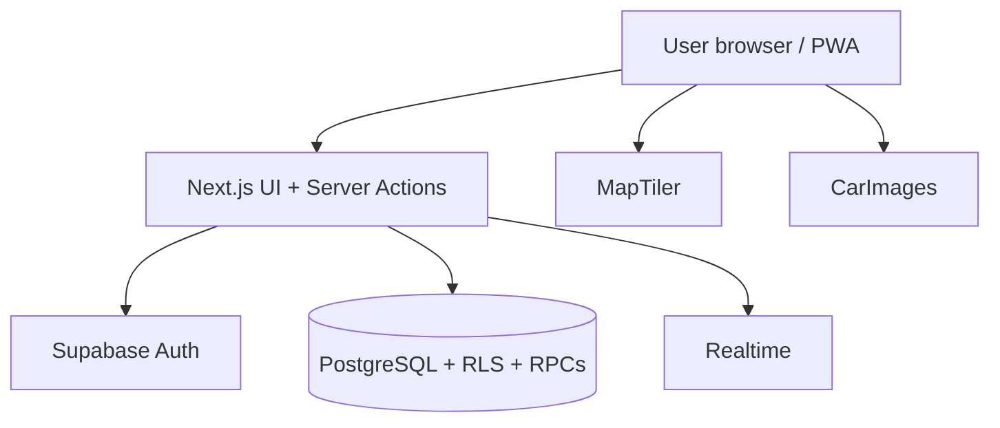
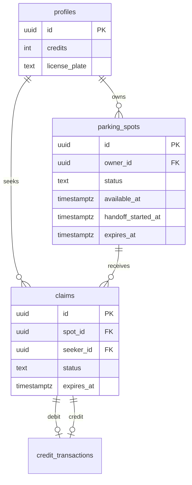
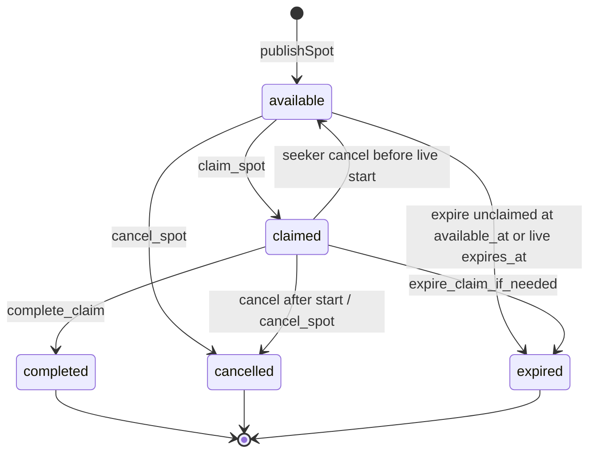

# Technical design — Switch It

Deep technical description based on the **current codebase and migrations**.  
If something is uncertain or not present, it is marked explicitly.

**STUDY PRIORITY** sections mark topics you should be able to explain orally.

This document separates:

- **CORE WEB MVP** — what the course demo depends on
- **OPTIONAL / EXPERIMENTAL / LEGACY** — present in the repo but not the main product story

---

# System overview

## CORE WEB MVP

| Layer | Actual choice | Evidence |
| --- | --- | --- |
| Framework | Next.js **16.2.12** (App Router) | `package.json` |
| UI | React **19.2.4** + TypeScript | `package.json` |
| Styling | Tailwind CSS **4** | `package.json`, `src/app/globals.css` |
| Auth + DB + Realtime | Supabase (`@supabase/ssr`, `@supabase/supabase-js`) | `src/lib/supabase/*` |
| Database | PostgreSQL via Supabase migrations | `supabase/migrations/` |
| Validation | Zod **4** | `src/lib/validations/*` |
| Maps (primary) | MapLibre GL **6** + MapTiler style/geocoding | `src/components/map/BaseMap.tsx`, `seekerMapConfig.ts` |
| Testing | Vitest **4** + Testing Library + jsdom | `package.json` |
| Deployment target | Vercel-compatible Next.js app | README; standard Next deploy (no `vercel.json` required) |
| Vehicle imagery | CarImages public JS loader + generic fallback | `src/lib/vehicle/carimages.ts` |

No Redux, Zustand, Prisma/ORM, Redis, or microservice layer is installed for app state.

## OPTIONAL / EXPERIMENTAL / LEGACY (not core architecture)

| Item | Status | Evidence |
| --- | --- | --- |
| Leaflet + react-leaflet | Legacy/alternate components still present | `ParkingMap.tsx`, `SpotLocationPicker.tsx` |
| Capacitor native pilot | Optional native shell + background location plugin | `capacitor.config.ts`, `native/` |
| Push notifications | Infrastructure exists; production iOS/APNs delivery **not** fully verified | `HandoffPushController`, migration `20260817180000_*` |
| Edge Functions | Used by native live-location / related pilots | `supabase/functions/` |
| Spoken verification codes | Legacy/dormant (not product UX) | `get_handoff_code` dormant; plate suffix is current |
| `vehicle-photos` storage bucket | Legacy artifact after photo feature removal | `20260818200000_drop_vehicle_photos.sql` |

---

# Architecture (CORE)



**Typical mutation path**

1. Client form / button → Server Action.
2. Action requires authenticated Supabase user (cookies).
3. Zod validates input.
4. Action calls Postgres RPC (or constrained insert for publish).
5. RPC checks `auth.uid()`, locks rows, enforces business rules.
6. Action maps errors to user-safe messages and revalidates paths.

**STUDY PRIORITY:** Why claim/complete live in PostgreSQL, not only in React.

---

# Project directory structure

```text
src/
  app/                 # Routes (pages, loading, error, auth callback)
  actions/             # Server Actions (mutations)
  components/          # UI (map, spots, auth, layout, …)
  lib/                 # Domain helpers (auth, map, spots, history, feedback, …)
  types/               # Shared TS types
supabase/
  migrations/          # Source of truth for schema + RPCs
  functions/           # Edge Functions (optional/pilot paths)
public/                # PWA assets, sw.js, branding, maplibre worker copies
docs/final-submission/ # This submission pack
```

| Area | Responsibility |
| --- | --- |
| `src/app` | Routing, RSC data loading, auth pages |
| `src/components` | Interactive UI, sheets, maps |
| `src/actions` | Authenticated mutations → Supabase |
| `src/lib` | Pure helpers, validation, error maps, Realtime hooks |
| `supabase/migrations` | Tables, indexes, RLS, RPCs |
| `*.test.ts(x)` | Automated tests (Vitest) |

---

# Main pages / routes

| Route | Purpose | Auth | Important components | Main server/DB interaction |
| --- | --- | --- | --- | --- |
| `/` | Landing; may redirect if session | Public | Landing UI | Session check |
| `/login` | Sign in | Public (redirect if authed) | Login form | `login` action → Auth |
| `/register` | Sign up | Public | Register form | `register` action → Auth + profile trigger |
| `/auth/callback` | Email confirmation / code exchange | Special | Route handler | `exchangeCodeForSession` |
| `/onboarding/vehicle` | Required vehicle setup | Authenticated | Vehicle form | Profile update |
| `/map` | Find parking (seeker) | Complete vehicle (seeker handoff exception) | Seeker map experience, claim UI | Load available spots; claim RPCs |
| `/spots/new` | Share a spot / publisher active spot | Complete vehicle (publisher exception) | Publish form / publisher experience | Insert spot; start/cancel/extend/complete |
| `/profile` | Profile + vehicle + prefs | Authenticated (incomplete allowed) | Profile/vehicle forms | Profile updates |
| `/history` | Past handoffs | Complete vehicle | History list | RPC `get_handoff_history` |
| `/help` | Help & Safety | Authenticated | Help content | Mostly static |
| `/offline` | PWA offline fallback | Public | Offline page | None |
| `/dev/car-images` | Dev imagery harness | Dev | CarImages grid | Client CarImages |

Only one App Router API-style handler found: `/auth/callback`. Business mutations use **Server Actions**, not a large REST API.

---

# Main React components (CORE)

| Component area | Role |
| --- | --- |
| `AuthenticatedShell` / `AuthenticatedFrame` | Auth gate + page chrome + `PageHeader` |
| `AppNav` / mode switch | Find parking vs Share a spot |
| `SeekerMapExperience` + MapLibre map | Discovery, selection, claim sheet |
| `PublishSpotForm` | Map-first compose + departure slider + publish |
| `PublisherSpotExperience` / `PublisherSpotCard` | Waiting / claimed / active publisher UI |
| `ClaimSpotButton` / `CompleteHandoffForm` | Claim + publisher verification |
| `CancellationReasonSheet` | Structured cancel reasons |
| `HistoryList` | Paginated history |
| Live location hooks/components | Active-claim seeker→publisher location |

---

# Server Actions / backend operations

| Action | File | DB / RPC |
| --- | --- | --- |
| `register` / `login` / `logout` | `src/actions/auth.ts` | Supabase Auth; profile created by trigger |
| `completeVehicleOnboarding` | `src/actions/onboarding.ts` | Update `profiles` vehicle fields |
| `updateDisplayName` / `updateVehicle` | `src/actions/profile.ts` | Update `profiles` |
| `publishSpot` | `src/actions/spots.ts` | Insert `parking_spots` |
| `startHandoffNow` | `src/actions/spots.ts` | RPC `start_handoff_now` |
| `cancelSpot` | `src/actions/spots.ts` | RPC `cancel_spot` |
| `claimSpot` | `src/actions/claims.ts` | RPC `claim_spot` |
| `completeClaim` | `src/actions/claims.ts` | RPC `complete_claim` |
| `cancelClaim` | `src/actions/claims.ts` | RPC `cancel_claim` |
| `extendHandoffWait` | `src/actions/claims.ts` | RPC `extend_handoff_wait` |
| `loadMoreHistory` | `src/actions/history.ts` | RPC `get_handoff_history` |
| `reconcileClaimTiming` | `src/actions/reconcile-claim.ts` | RPC `expire_claim_if_needed` |

---

# Database design

## Core tables

### `profiles`
App user row (1:1 with `auth.users`): `credits` (default 5), display name, vehicle fields. Clients cannot update `credits` via column grants.

### `parking_spots`
Published handoff listing. Status: `available | claimed | completed | cancelled | expired`. Timing: `available_at`, `handoff_started_at`, `expires_at`, `handoff_extension_used_at`. One open spot per owner.

### `claims`
Seeker claim on a spot. Status: `active | completed | cancelled | expired`. Cancel metadata: `cancelled_by`, `cancelled_reason`. Uniques: one active claim per spot; one active claim per seeker.

### `credit_transactions`
Append-only ledger: `initial_grant`, `handoff_debit`, `handoff_credit`. Partial uniques: one debit and one credit per `claim_id`.

## Support tables (exist; secondary in presentation)

| Table | Role |
| --- | --- |
| `claim_handoff_secrets` | Attempt/lock state for plate verification (spoken-code UX dormant) |
| `claim_live_locations` | Ephemeral **latest** seeker GPS snapshot per active claim (recovery path; not route history) |
| `push_devices` / `handoff_notification_events` | Optional push pipeline |

## ER diagram (core)



`license_plate` is nullable until vehicle onboarding completes. App writes store **digits only** (length 5–8) after normalizing separators. PostgreSQL CHECK `profiles_license_plate_digits_allowed` enforces `NULL OR ^[0-9]{5,8}$`. Duplicate plates across profiles remain allowed (shared vehicles); there is **no** UNIQUE constraint on the column.

---

# PostgreSQL RPC functions (CORE)

**STUDY PRIORITY**

### `claim_spot(p_spot_id, p_seeker_latitude, p_seeker_longitude)`
- Caller: seeker.
- Locks spot `FOR UPDATE`.
- Validates available + not expired; distance ≤ 1500 m; credits ≥ 1 (**check only**); not owner; no other active claim; no prior voluntary release of same spot.
- Unstarted: must claim before `available_at`; reserves claim expiry as `available_at + 3 minutes`.
- Started (Now / early start): claim allowed while `now < expires_at`; uses **remaining** `expires_at` (no timer reset).
- Sets spot to `claimed`.

### `start_handoff_now(p_spot_id)`
- Caller: owner.
- Idempotent if already started.
- Unclaimed before `available_at`: set `handoff_started_at` / `expires_at = now+3m`, keep **`available`**.
- Claimed before `available_at`: start that handoff immediately.
- After `available_at` unclaimed: expire / unavailable.

### `auto_start_claimed_handoff_if_due` (internal)
Claimed + due → start live window; used by expire/complete/extend paths.

### `extend_handoff_wait(p_claim_id)`
Publisher; one +2 minute extension; hard cap `handoff_started_at + 5 minutes`. Rejected before start (`HANDOFF_NOT_READY` if still unstarted after auto-start attempt).

### `complete_claim(p_claim_id, p_plate_suffix)`
- Caller: **publisher** (spot owner).
- If due, may auto-start first; if still unstarted → `HANDOFF_NOT_STARTED`.
- Verifies seeker’s last 2 plate digits.
- Success: complete claim+spot; seeker −1 / owner +1; ledger rows.
- Wrong digits: attempts; lock after 3 failures (~2 minutes).
- Idempotent if already completed with consistent ledger.

### `cancel_claim` / `cancel_spot`
Structured reasons required. Seeker cancel before live start can reopen listing; after start ends the exchange. No credits.

### `expire_claim_if_needed` / `expire_spot_if_needed`
Reconcile due expirations / auto-start then expire. No credits.

### `get_handoff_history`
Keyset pagination of terminal claims for current user.

### `get_handoff_counterpart_vehicle`
Masked plate + vehicle fields for the other party.

`get_handoff_code` exists but is **legacy/dormant** (not the product path).

---

# Parking spot state machine



### Timing fields

| Field | Meaning |
| --- | --- |
| `available_at` | Promised departure chosen at publish |
| `handoff_started_at` | Actual live start (Now, I’m leaving now, or auto at departure when claimed) |
| `expires_at` | Authoritative deadline for listing/handoff |

---

# Claim / handoff lifecycle

1. Seeker claims → active claim + spot `claimed` (or claim into already-started available Now window).
2. Pre-start: countdown to `available_at` for future listings.
3. Start: early button, Now, or auto at departure if claimed.
4. Active window: 3 minutes from actual start; optional +2 once; max 5 from start.
5. Terminal: completed / cancelled / expired.

**Race conditions handled in DB**

- Concurrent claims: row lock + unique active claim per spot.
- Concurrent claim vs early start: lock/re-read paths in `start_handoff_now`.
- Double completion: ledger uniqueness + idempotent complete path.

---

# Credits

| Event | Credits |
| --- | --- |
| New account | +5 (`initial_grant`) via signup trigger |
| Claim | **Checked** (≥1); **not moved** |
| Start / extend / cancel / expire / I’m leaving now | **Not moved** |
| Successful `complete_claim` | Seeker **−1**, publisher **+1** once |

---

# State management

| Kind | How |
| --- | --- |
| Source of truth | PostgreSQL |
| Server-rendered | RSC pages load spots/claims/history |
| Client React state | Local UI (sheets, map selection, optimistic hints) |
| URL | Feedback query params, auth `next` |
| Realtime | Supabase channels refresh/merge UI |
| Global client store | **Not currently implemented** |

---

# Realtime

Used for:

- Seeker discovery: `parking_spots` changes.
- Publisher spot/claim updates on Share a spot.
- Active handoff reconciliation triggers.
- Private Broadcast for seeker live location during a claim.

DB remains authoritative if a message is missed (refresh / reconcile RPCs).

---

# Live location (accurate current behavior)

| Path | Behavior |
| --- | --- |
| Web / PWA | Foreground `watchPosition` + **private Realtime Broadcast** to `claim-location:<claimId>` |
| Native pilot | Background GPS → Edge Function → `upsert_claim_live_location` then Broadcast |
| Publisher UI | Subscribes to Broadcast; may **read** `claim_live_locations` as a recovery snapshot if the first broadcast was missed |
| Persistence | **Not** “never stored.” Native/Edge path writes an ephemeral **latest** row (one per claim, replaced on upsert). Deleted when the claim becomes terminal. **Not** a route-history trail |
| Product UX | Sharing is **mandatory** for an active claim in the current UI (starts with the panel); still depends on permission/GPS |

---

# Error handling

- RPCs raise business codes (`SPOT_EXPIRED`, `INSUFFICIENT_CREDITS`, `HANDOFF_NOT_STARTED`, …).
- `src/lib/feedback/error-map.ts` maps to user-facing strings.
- Server Actions return typed error states; toasts via feedback shell.
- Route `error.tsx` / `global-error.tsx` for unexpected failures.

---

# Validation

| Layer | Examples |
| --- | --- |
| Client UX | Disable buttons, distance notice, digit length |
| Server Actions | Zod schemas |
| Database | CHECK constraints (including license_plate format), RPC raises, unique indexes |

---

# External services (CORE)

| Service | Why | Data sent | Failure behavior |
| --- | --- | --- | --- |
| Supabase Auth/DB/Realtime | Core backend | Account + handoff data | App cannot function without it |
| MapTiler | Map style + geocoding | Location queries; public API key | Map/geocode degraded if key missing |
| CarImages | Catalog vehicle image | Make/model/year via public loader key | Generic illustration fallback |
| Waze/Google/Apple Maps | External navigation | Destination coordinates via deep links | User leaves app; no in-app routing |

---

# UX design

- Phone-first shell, safe-area aware bottom sheets.
- Map-first seeker and publisher compose flows.
- Minimal instructional copy on claim sheet; Help & Safety for longer explanations.
- Mode tabs: Find parking vs Share a spot.
- Countdowns for departure and live window.
- Primary seeker map: **MapLibre + MapTiler** (not Leaflet).

---

# Repository references

- `package.json`
- `src/proxy.ts`, `src/lib/supabase/*`
- `src/actions/*.ts`
- `src/app/**/page.tsx`
- `src/lib/spots/constants.ts`, `src/lib/map/distance.ts`, `src/lib/feedback/error-map.ts`
- `src/lib/location/use-seeker-live-location-share.ts`, `use-publisher-live-location.ts`, `fetch-claim-live-location.ts`
- `supabase/migrations/20260802110120_initial_schema.sql`
- `supabase/migrations/20260819130000_prevent_seeker_reclaim.sql`
- `supabase/migrations/20260819140000_unclaimed_early_start_live_window.sql`
- `supabase/migrations/20260818210000_auto_start_handoff_at_departure.sql`
- `supabase/migrations/20260817140000_claim_live_locations_snapshot.sql`
- `README.md`
